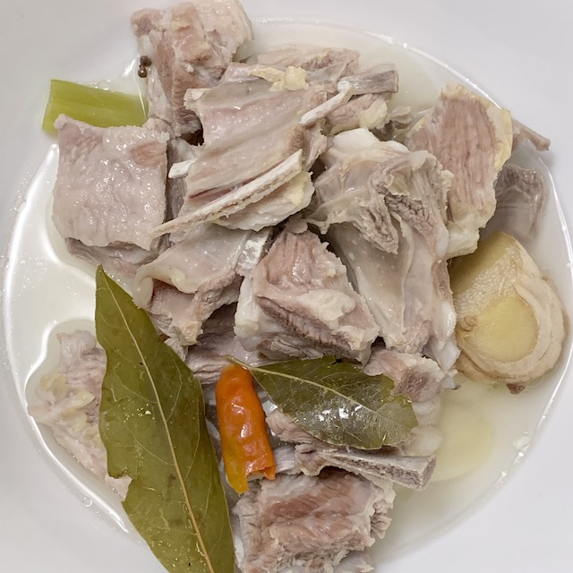

= 手抓羊肉

注意手抓羊肉和手抓羊肉饭是两道完全不同的菜⋯⋯

== 原料

* 羊排一斤
* 蒜四瓣
* 姜
* 大葱一段或小葱若干段
* 香叶
* 大料
* 茴香
* 孜然
* 花椒
* 干辣椒
* 盐

== 工序

. 羊排切成小段，在凉水里泡一小时
. 冷水下锅煮羊排，多放点水。开锅后把沫撇干净。
. 放入除盐以外的其他所有配料
. 小火煮一小时
. 放入盐，不用放很多，就是稍微出点味，最后是要蘸椒盐吃的。
. 再煮半小时
. 出锅，蘸椒盐吃。

== 结果

