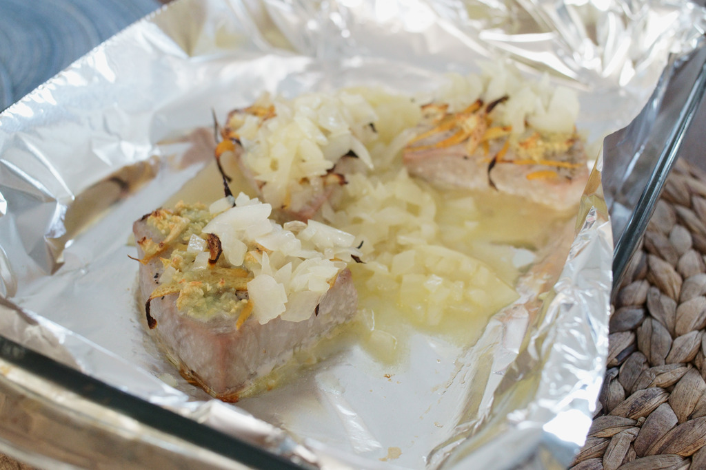

= 烤马哈鱼

== 原料

* 马哈鱼肉排
* 柠檬
* 盐
* 黑胡椒
* 洋葱
* 橄榄油
* 蒜

== 工序

. 在鱼两面洒上盐和黑胡椒。
. 用削土豆皮的那种东西给柠檬削皮，把削下来的皮切成丝或碎屑，摆放在鱼肉上（显然只摆一面）。柠檬放在旁边备用。
. 蒜挤成蒜泥，抹在鱼上（只抹一面）。
. 鱼可以这样腌一段时间，不腌也行。
. 烤盘上刷橄榄油，把鱼放进去。进烤箱 220°C 烤 15–20 分钟。
. 把洋葱切成粒，找个炒锅，倒入橄榄油，放洋葱呛锅，然后把柠檬汁挤进去，炒洋葱到半熟。如果不喜欢酸味也可以不挤柠檬汁或少挤一点。
. 把炒好的洋葱浇在烤好的鱼上。

== 结果

