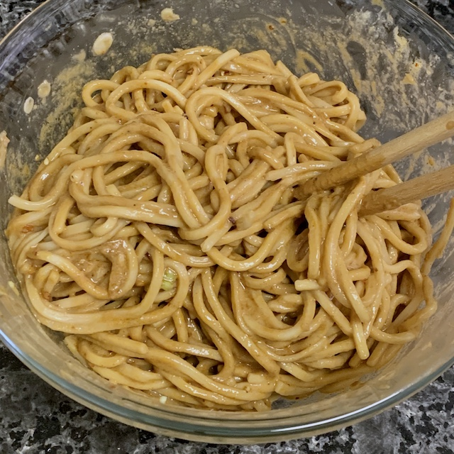

= 祖传热干面

== 原料

* 面条
* 蒜
* 芝麻酱
* 生抽
* 老抽
* 盐
* 辣椒油
* 胡椒粉
* 香油
* 葱花

== 工序

. 用热水化开两大勺麻酱并搅匀，浓度大概跟涮羊肉的蘸料差不多。
. 倒入生抽，大概跟平时吃饺子用的醋量差不多。
. 倒入老抽，大概跟平时吃饺子用的醋量差不多。
. 倒入香油，大概比平时吃饺子用的醋量少一点。
. 倒入海量辣椒油
. 倒入适量胡椒粉
. 倒入一点盐
. 把三瓣蒜捣成蒜泥扔进去
. 搅匀
. 煮好面条，把前面拌好的料全倒进去
. 加入葱花，拌匀，然后就没有然后了。

== 结果

