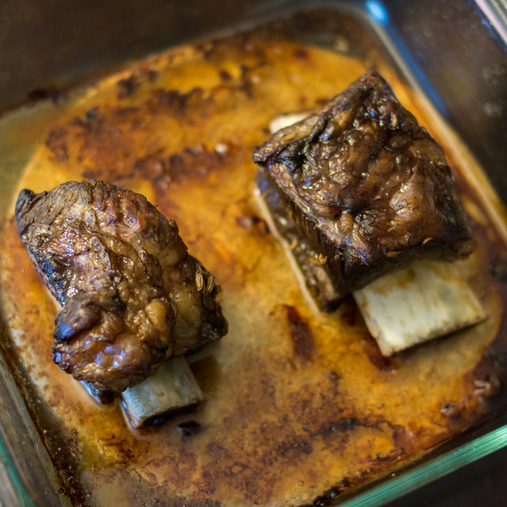

= 祖传烤牛小排

v1.5 （只试过一次，有些改进，但是改进还没有实践过）

== 原料

* 切好的牛小排若干段
* 蒜，可能得要半头
* 姜，几片？
* 料酒
* 红酒
* 盐
* 糖

== 工序

1. 把牛小排整齐地排列在一个碗里，在空隙里塞上蒜和姜
2. 倒入料酒和红酒，要没过牛肉，料酒和红酒的比例大概是 1:1。
3. 倒入盐和糖。我第一次做的时候以为有红酒就不用放糖了，其实 naive. 还是要放的。
4. 放冰箱里腌一晚上。
5. 第二天把牛肉拿出来放到烤盘里，烤盘上面盖上锡箔。可以尝试在旁边放点蒜和葡萄藤什么的……
6. 烤箱预热到 180℃，然后把牛肉放进去烤四十分钟（第一次试了一个小时，但是有点长了）
7. 把锡箔去掉，再烤半小时。
8. 完成。

== 结果

