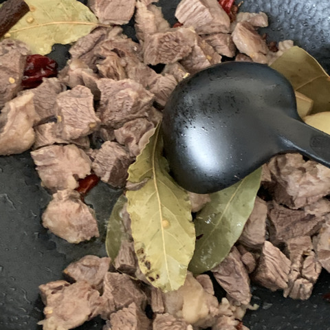

= 祖传贵州炖牛肉

== 原料

* 牛肉
* 姜，大概 2–3 cm³
* 花椒一撮
* 大料一个
* 桂皮一块
* 草果一个
* 陈皮，用削土豆皮的那个玩意从桔子或者柠檬上撮五条下来
* 料酒
* 香叶一小坨
* 干辣椒一坨

== 工序

. 牛肉切块，泡冷水半小时
. 把牛肉冷水下锅煮，开锅以后撇沫。然后把牛肉捞出来，水倒掉。此时开始烧水。
. 如果煮锅不够大的话另找一个炒锅，倒油，放入姜、花椒、大料、桂皮、草果、香叶和干辣椒，翻炒。
+

+
. 炒出香味以后倒入牛肉，再随便炒几下。
+

+
. 倒一点料酒，接着炒个几分钟，把料酒炒干。
. 如果煮锅和炒锅不是同一个锅的话，煮锅开火把锅烧热，然后把炒锅里的东东倒到煮锅里，同时放入陈皮。
. 这时第二步烧的水应该开了，把开水倒进煮锅，没过牛肉即可，煮一个小时。
. 放盐，再煮半小时就好了。

据说这道菜用铸铁锅煮最好，但是有可能是玄学。

== 结果

忘了拍照了⋯⋯
