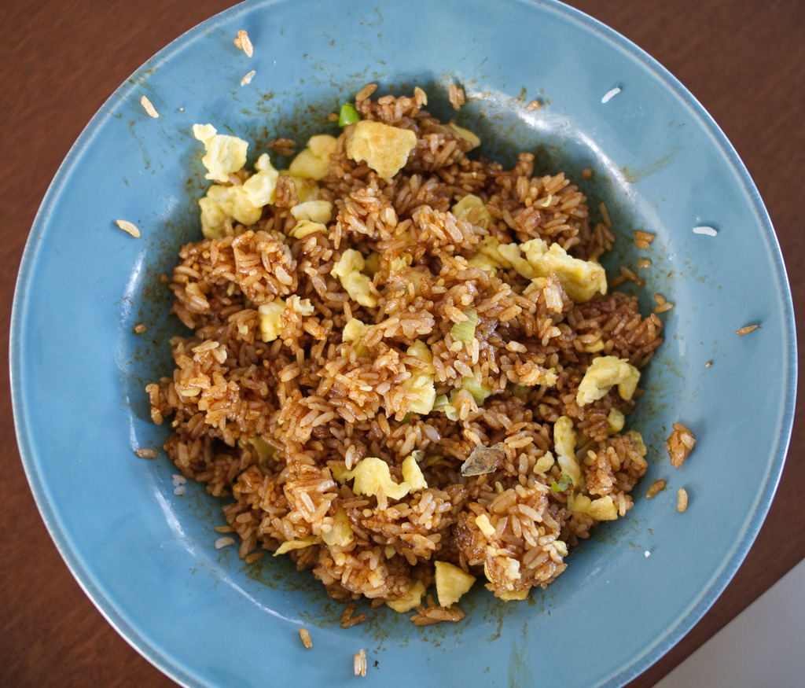

= 酱油炒饭

== 原料

* 剩米饭
* 老抽
* 料酒
* 葱
* 糖
* 鸡蛋
* 油
* 盐或生抽

== 工序

. 把米饭撸成粒粒分明的状态。
. 倒入酱油、一点料酒、一点糖、一点油搅拌。老抽不咸，所以可以再放点盐或生抽，搅拌均匀。拌好后米饭的颜色应该是屎棕色。
. 把鸡蛋炒成浅黄色，炒碎。
. 锅里倒油，加入葱花炒香，然后倒入米饭炒一会儿。
. 倒入炒鸡蛋，再炒一小会儿，然后就好了。

== 结果

